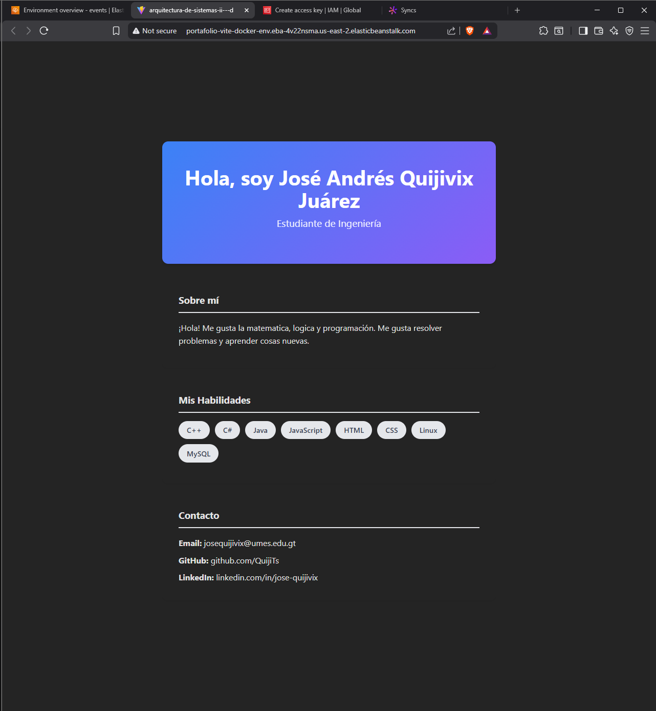
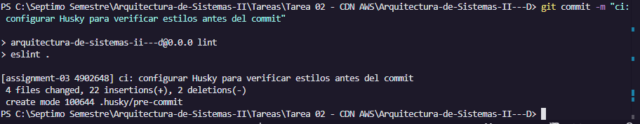
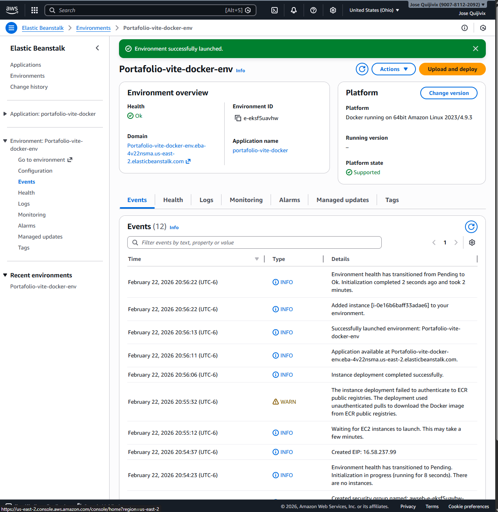
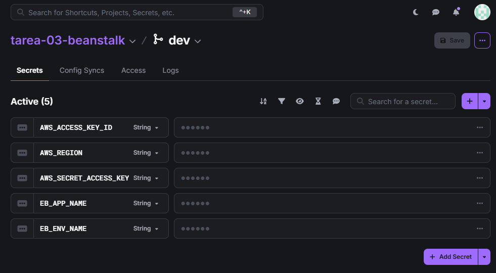
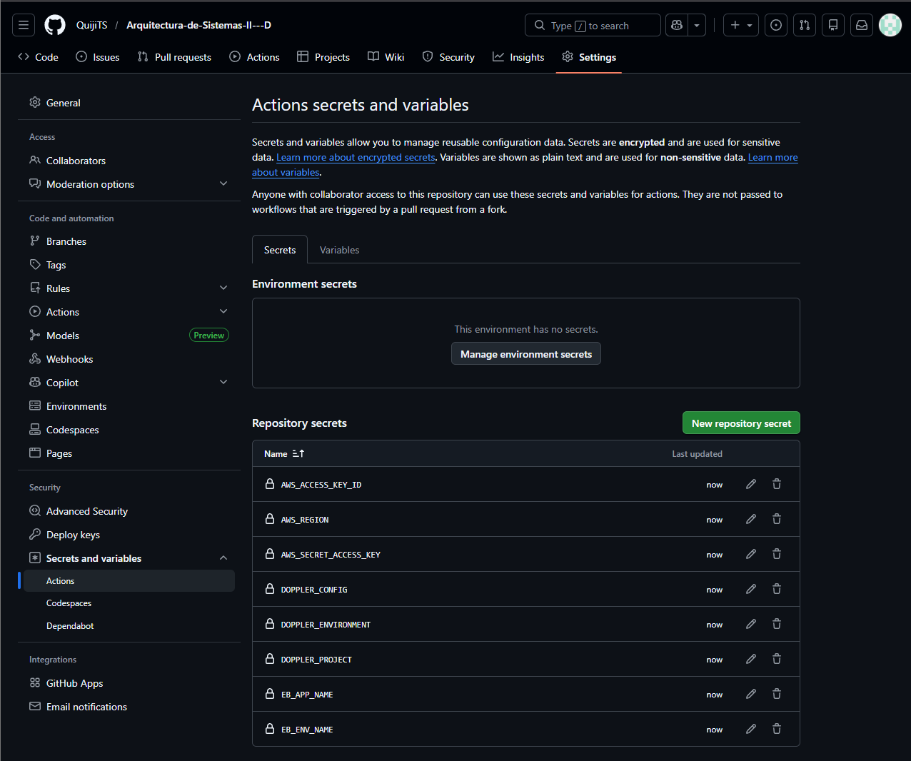
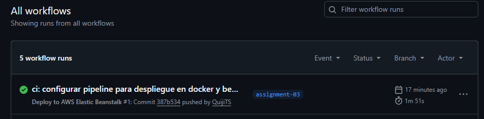

# Arquitectura de Sistemas II - Tarea 03

Este repositorio contiene la configuración y el despliegue continuo de un portafolio web creado con Vite, dockerizado y alojado en AWS Elastic Beanstalk mediante integración continua.

## 🌐 URL de la Aplicación en Vivo
La aplicación se encuentra pública y funcionando en la siguiente dirección:
[http://portafolio-vite-docker-env.eba-4v22nsma.us-east-2.elasticbeanstalk.com](http://portafolio-vite-docker-env.eba-4v22nsma.us-east-2.elasticbeanstalk.com)

---

## Entregables y Evidencias

### 1. Aplicación Funcionando
Captura de la aplicación web desplegada exitosamente en la nube.

### 2. Explicación del uso de Husky
Se implementó **Husky** para la gestión automatizada de *Git Hooks*. Específicamente, se configuró un gancho `pre-commit` que intercepta cualquier intento de hacer un *commit* y ejecuta automáticamente el comando `npm run lint` (ESLint). Esto nos sirve como un "perro guardián" que obliga a que todo el código cumpla con las reglas de estilo y sintaxis antes de permitir que se guarde en el historial, garantizando código limpio y profesional en todo el repositorio.

### 3. Configuración de AWS Elastic Beanstalk
El entorno fue creado bajo la capa gratuita (Free Tier) de AWS, configurado en modo *Single instance* utilizando la plataforma de Docker nativa.

### 4. Gestión de Secretos (Doppler + GitHub)
Las credenciales de AWS (Access Key, Secret Key y Región) y variables de entorno fueron almacenadas de forma encriptada en Doppler y sincronizadas automáticamente hacia los secretos de GitHub.

### 5. Pipeline de CI/CD (GitHub Actions)
Se diseñó un flujo de GitHub Actions que se dispara automáticamente con cada push a la rama `assignment-03`. El pipeline realiza el build de la imagen de Docker para validar la integridad del código, empaqueta los archivos necesarios y despliega la nueva versión directamente en AWS Elastic Beanstalk.
