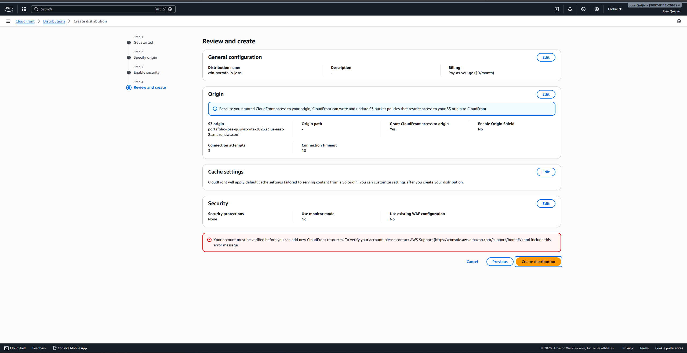
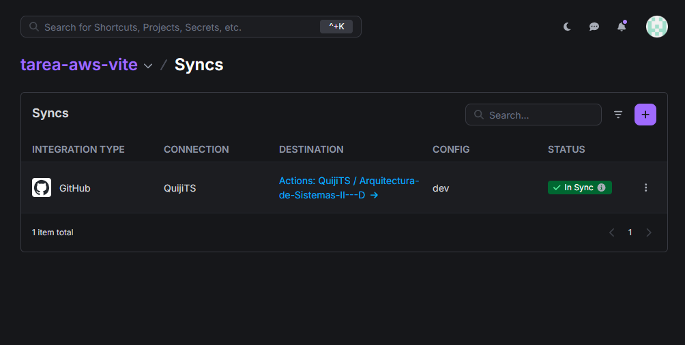
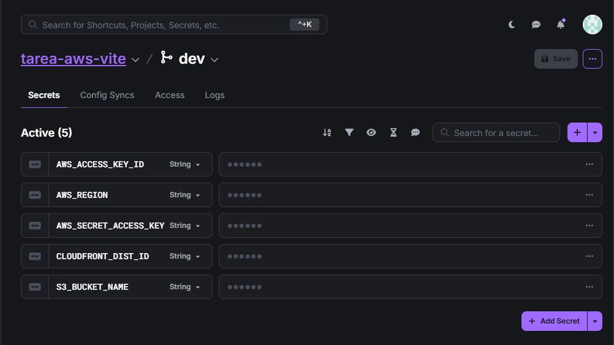
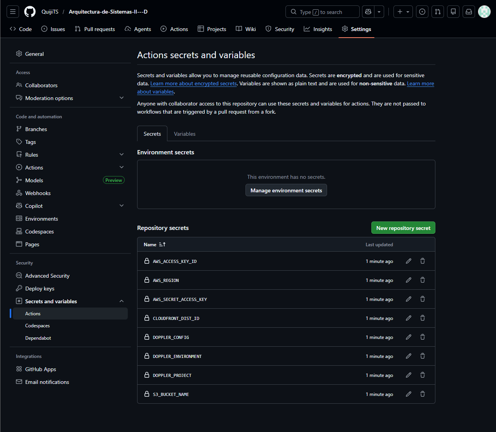
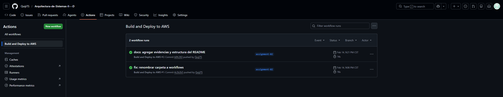
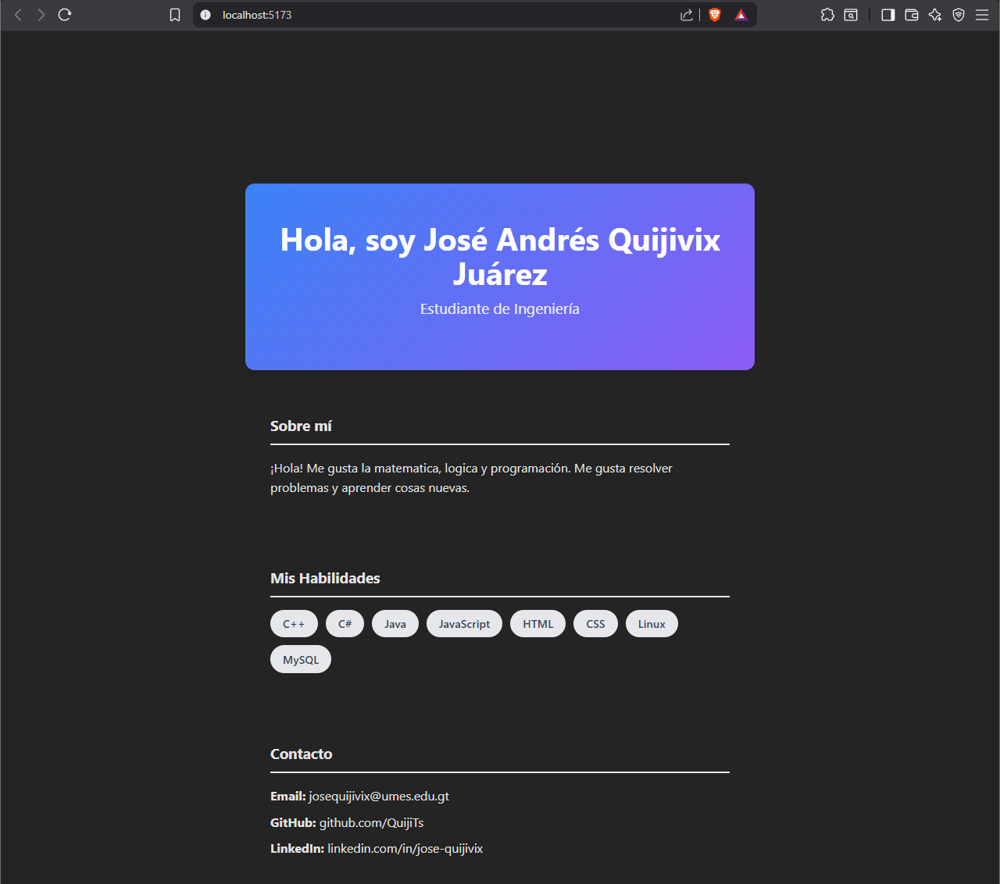

# Despliegue de Aplicación Web en AWS S3 y CloudFront

Esta es la entrega para la actividad de configuración de CDN y despliegue continuo.

> **Nota Importante sobre la entrega:**
> La configuración de la infraestructura base, gestión de secretos en Doppler y el pipeline de CI/CD (GitHub Actions) fue completada exitosamente, logrando automatizar el despliegue hacia AWS S3. Sin embargo, la creación de la distribución en AWS CloudFront se encuentra actualmente bloqueada por un proceso automático de verificación de cuenta por parte de AWS. 
> 
> Por este motivo, la URL pública del CDN no está disponible en este momento. A continuación se adjuntan las evidencias del trabajo completado y del bloqueo de seguridad de la plataforma.

## Entregables Completados

### 1. Evidencia del Bloqueo de AWS (Verificación de Cuenta)

### 2. Integración con Doppler (Config Syncs)

### 3. Variables de Entorno en Doppler

### 4. Secretos Sincronizados en GitHub

### 5. Pipeline de GitHub Actions (Despliegue a S3 Exitoso)

### 6. Aplicación Funcionando (Vista Local/Build)
