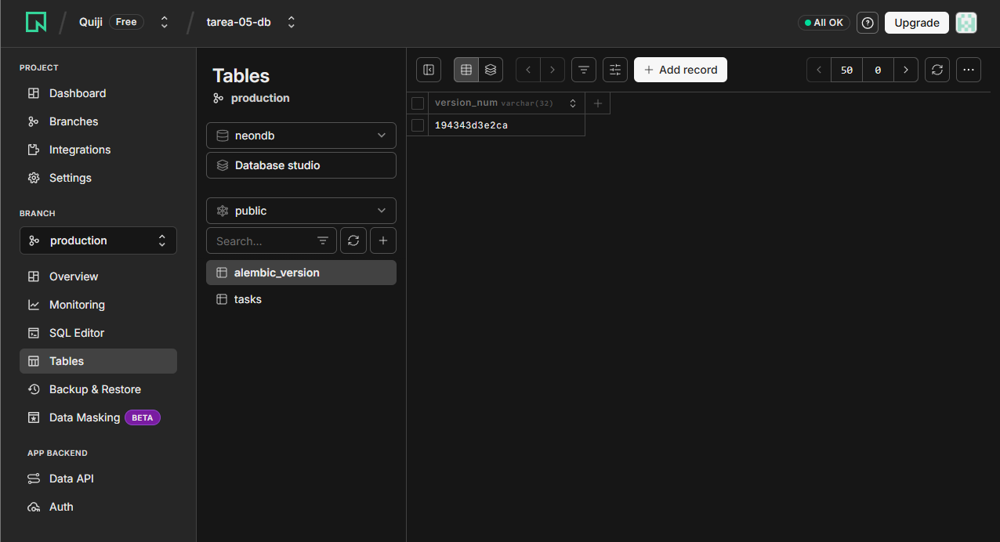
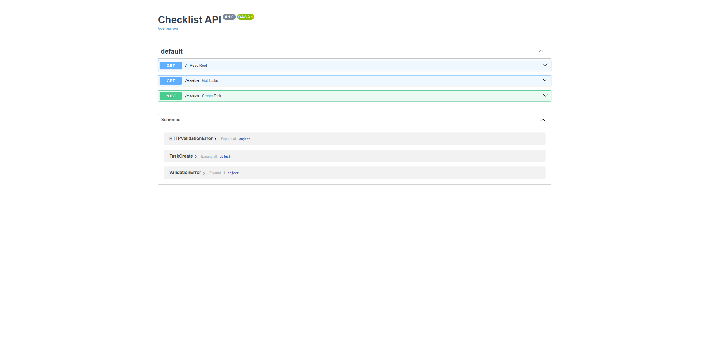

# Arquitectura de Sistemas II - Tarea 05: Monorepo Deployment

Este repositorio contiene la configuración de un monorepo que incluye un frontend en React (Vite) y un backend en FastAPI (Python), conectados a una base de datos PostgreSQL en la nube (Neon DB). El despliegue automatizado se realizó en Render.com, integrando la gestión de secretos de la base de datos directamente con Doppler.

## 🌐 Enlaces de la Aplicación en la Nube

* **Frontend (Aplicación Web - Interfaz):** [https://checklist-frontend-4483.onrender.com](https://checklist-frontend-4483.onrender.com)
* **Backend (API Base):** [https://checklist-backend-x17t.onrender.com](https://checklist-backend-x17t.onrender.com)
* **Documentación de la API (Swagger UI):** [https://checklist-backend-x17t.onrender.com/docs](https://checklist-backend-x17t.onrender.com/docs)

---

## 📸 Entregables y Evidencias

### 1. Base de Datos y Migraciones
A continuación se muestra la evidencia de la base de datos en Neon DB, donde se confirma la creación de la tabla `tasks` y la tabla `alembic_version`, confirmando el uso correcto de migraciones para la estructura de datos.

### 2. Documentación de la API
Evidencia del sistema de documentación automático generado por FastAPI, el cual permite visualizar y probar el correcto funcionamiento de los endpoints del backend.

