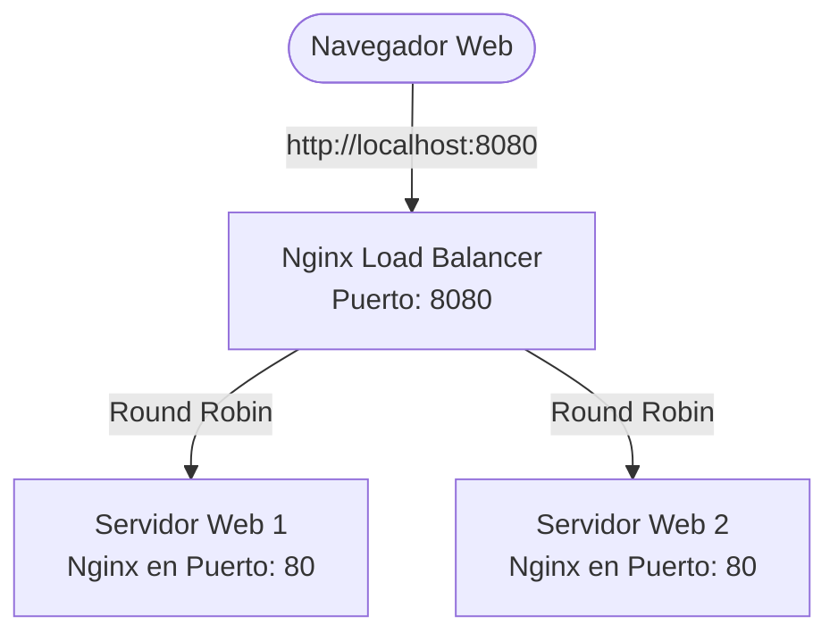

# Tarea 01 - Load Balancer

## Diagrama de la Infraestructura

A continuación se muestra la arquitectura del balanceador de carga utilizando Nginx y Docker Compose:



## Comando para ejecutar la infraestructura

Para levantar toda la infraestructura descrita anteriormente, hay que tener instalado Docker y ejecuta el siguiente comando en la raíz del proyecto (donde se encuentra el archivo docker-compose.yml):

```bash
docker compose up -d
```

Para apagarlo se utiliza el siguiente comando en la raíz del proyecto:

```bash
docker compose down
```

## URL del balanceador de carga

Una vez que los contenedores estén en ejecución, puedes acceder al balanceador de carga ingresando a la siguiente dirección en tu navegador:

[http://localhost:8080](http://localhost:8080)
