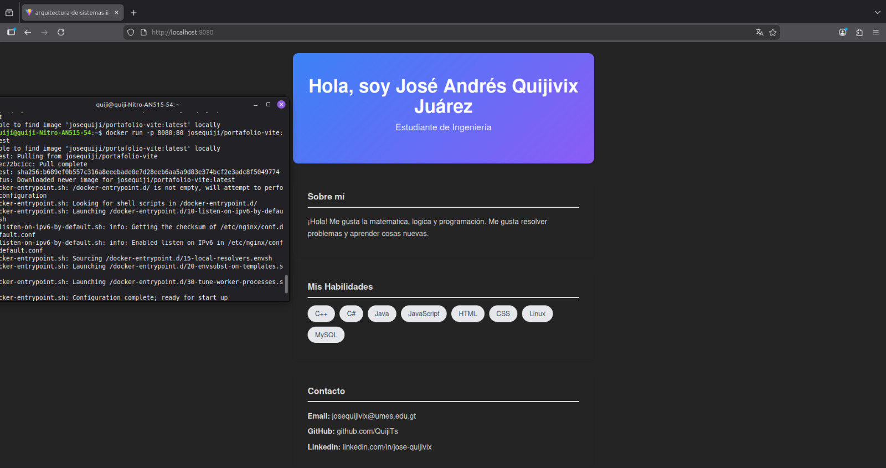
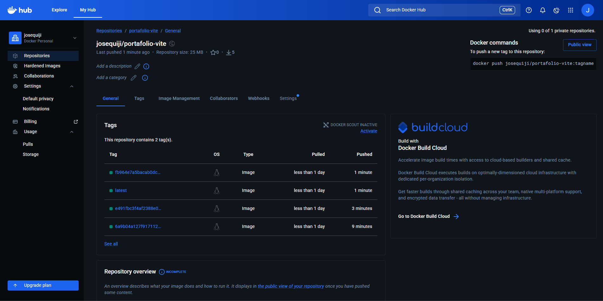
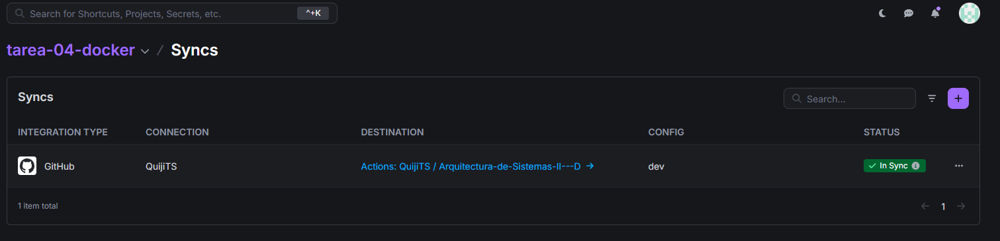
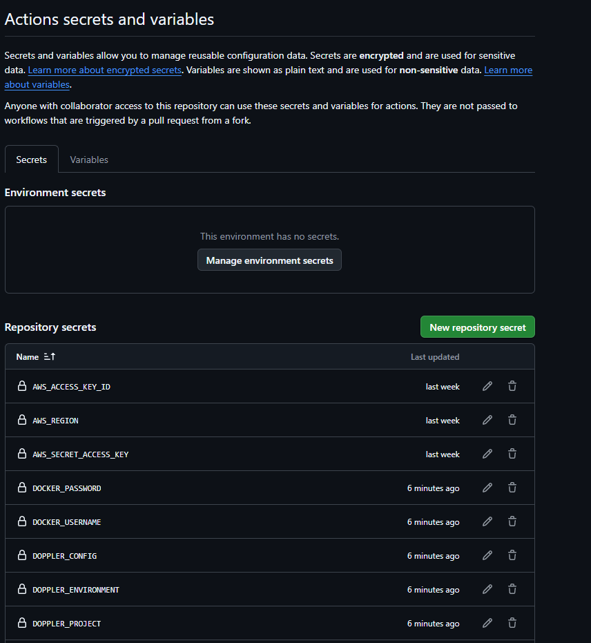

# Arquitectura de Sistemas II - Tarea 04

Este repositorio contiene la configuración de integración continua (CI) para dockerizar un portafolio web creado con Vite y publicarlo automáticamente en un registro público utilizando GitHub Actions.

## 🐳 URL de la Imagen en Docker Hub
La imagen de Docker construida automáticamente se encuentra pública y disponible en el siguiente enlace:
[https://hub.docker.com/r/josequiji/portafolio-vite](https://hub.docker.com/r/josequiji/portafolio-vite)

---

## Entregables y Evidencias

### 1. Aplicación Web
Captura mostrando la interfaz gráfica del portafolio web dockerizado.

### 2. Imágenes y Tags en Docker Hub
Mediante el pipeline de GitHub Actions, se configuró el etiquetado automático. Por cada commit realizado, la imagen más reciente recibe la etiqueta `latest`, mientras que el historial de versiones se mantiene etiquetando cada imagen con el SHA del commit correspondiente. A continuación se evidencian las 4 etiquetas generadas tras los 3 commits requeridos.

### 3. Gestión de Secretos (Doppler + GitHub)
Para garantizar la seguridad de las credenciales, el token de acceso personal de Docker Hub (`DOCKER_PASSWORD`) y el nombre de usuario (`DOCKER_USERNAME`) fueron almacenados en un proyecto específico de **Doppler**. Posteriormente, se configuró una sincronización automática para inyectar estas variables de entorno en los secretos de GitHub Actions, evitando así la exposición de datos sensibles en el código.

