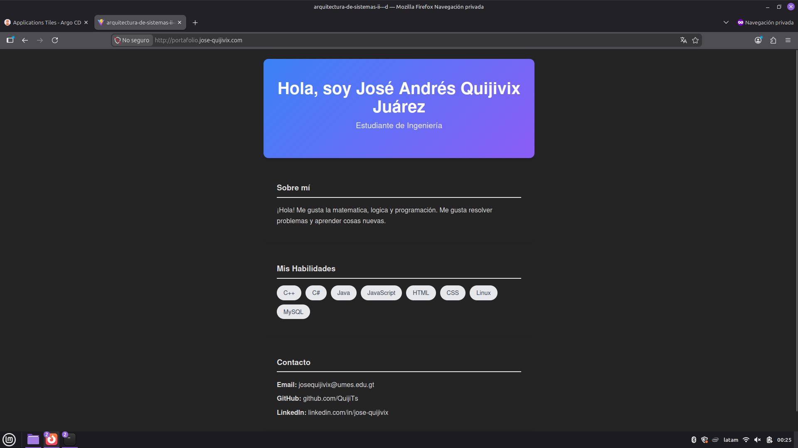
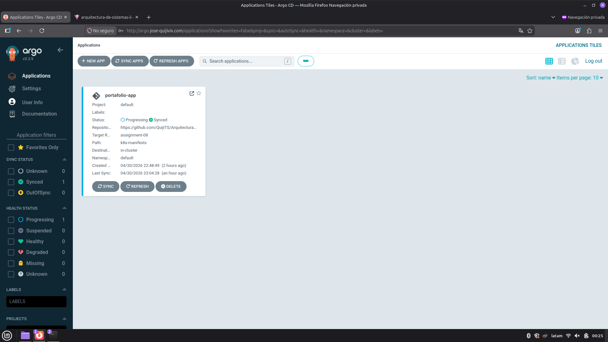
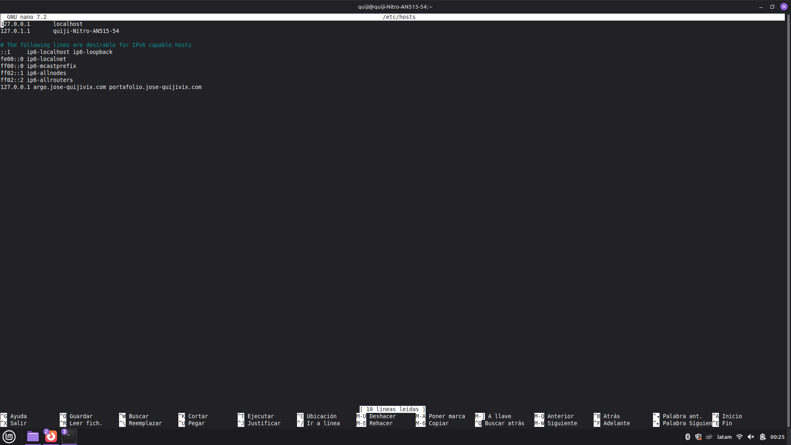

# Tarea 08 - Clúster de Kubernetes usando Minikube

**Nombre:** José Quijivix
**Carné:** 202308069

## 1. Capturas de Pantalla

### Aplicación usando DNS con dominio configurado


### Configuración de ArgoCD (Sincronizado)


### Configuración de DNS Local


---

## 2. Manifiestos de las Aplicaciones (Infraestructura como Código)

### `portafolio-app.yaml` (Despliegue y Servicio de la Semana 4)
```yaml
apiVersion: apps/v1
kind: Deployment
metadata:
  name: portafolio-vite
  namespace: default
  labels:
    app: portafolio
spec:
  replicas: 1
  selector:
    matchLabels:
      app: portafolio
  template:
    metadata:
      labels:
        app: portafolio
    spec:
      containers:
      - name: portafolio
        image: josequiji/portafolio-vite:latest
        ports:
        - containerPort: 80
---
apiVersion: v1
kind: Service
metadata:
  name: portafolio-service
  namespace: default
spec:
  selector:
    app: portafolio
  ports:
    - protocol: TCP
      port: 80
      targetPort: 80
```

### `portafolio-ingress.yaml` (Ruta de Traefik para la app)
```yaml
apiVersion: traefik.io/v1alpha1
kind: IngressRoute
metadata:
  name: portafolio-ingress
  namespace: default
spec:
  entryPoints:
    - web
  routes:
    - match: Host(`portafolio.jose-quijivix.com`)
      kind: Rule
      services:
        - name: portafolio-service
          port: 80
```

### `argocd-ingress.yaml` (Ruta de Traefik para ArgoCD)
```yaml
apiVersion: traefik.io/v1alpha1
kind: IngressRoute
metadata:
  name: argocd-server-ingress
  namespace: argocd
spec:
  entryPoints:
    - web
  routes:
    - match: Host(`argo.jose-quijivix.com`)
      kind: Rule
      services:
        - name: argocd-server
          port: 80
```

### `argocd-app.yaml` (Configuración GitOps de ArgoCD)
```yaml
apiVersion: argoproj.io/v1alpha1
kind: Application
metadata:
  name: portafolio-app
  namespace: argocd
spec:
  project: default
  source:
    repoURL: 'https://github.com/QuijiTS/Arquitectura-de-Sistemas-II---D.git'
    targetRevision: assignment-08
    path: k8s-manifests
  destination:
    server: 'https://kubernetes.default.svc'
    namespace: default
  syncPolicy:
    automated:
      prune: true
      selfHeal: true
```

---

## 3. Lista de comandos ejecutados

A continuación se detalla la secuencia de comandos utilizada para levantar todas las aplicaciones y configurar el clúster sin intervención manual:
```bash
# 1. Iniciar Minikube con el driver de Docker
minikube start --driver=docker

# 2. Instalar definiciones (CRDs) y permisos (RBAC) para Traefik
kubectl apply -f https://raw.githubusercontent.com/traefik/traefik/v3.0/docs/content/reference/dynamic-configuration/kubernetes-crd-definition-v1.yml
kubectl apply -f https://raw.githubusercontent.com/traefik/traefik/v3.0/docs/content/reference/dynamic-configuration/kubernetes-crd-rbac.yml

# 3. Desplegar Traefik utilizando el manifiesto local
kubectl apply -f k8s-manifests/traefik-deployment.yaml

# 4. Crear namespace e instalar ArgoCD (Manifiesto Oficial)
kubectl create namespace argocd
kubectl apply -n argocd -f https://raw.githubusercontent.com/argoproj/argo-cd/stable/manifests/install.yaml

# 5. Configurar ArgoCD en modo HTTP (Inseguro) para enrutamiento local con Traefik
kubectl patch configmap argocd-cmd-params-cm -n argocd -p '{"data": {"server.insecure": "true"}}'
kubectl rollout restart deployment argocd-server -n argocd

# 6. Sincronizar la aplicación (GitOps) hacia el clúster
kubectl apply -f argocd-app.yaml

# 7. Crear el puente de red para acceder mediante los dominios configurados en /etc/hosts
sudo /usr/local/bin/kubectl --kubeconfig=/home/quiji/.kube/config port-forward svc/traefik 80:80
```
